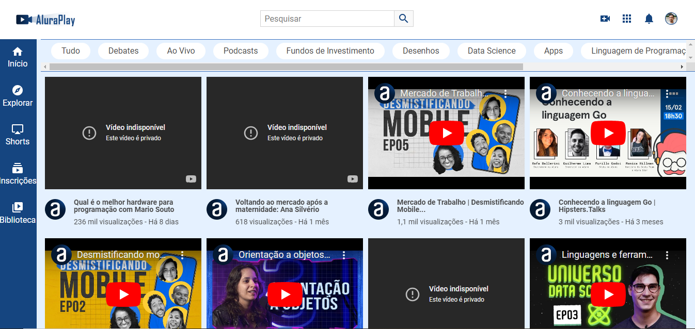

<h1 align="center">Curso CSS</h1> 

**Curso:** CSS: Flexbox e layouts responsivos
 

**Link para o curso:** https://cursos.alura.com.br/course/css-flexbox-layouts-responsivos

---
### Sobre o Projeto

Este diretório foi criado para armazenar o projeto desenvolvido durante o Curso "CSS: Flexbox e layouts responsivos" da Alura.  
O projeto consiste na construção de uma página conforme wireframe no Figma. 

**Link do wireframe no Figma:** https://www.figma.com/file/58USt8VzUEqJy7Acno5WFr/Alura-Play?type=design&node-id=0-1&mode=design&t=LigwsSFoudzQ0huG-0  

---
### Objetivo

- Aprender a utilizar propriedades do Flexbox na prática construindo um projeto responsivo;
- Alterar o eixo de itens para horizontal ou vertical;
- Aplicar vídeos de forma responsiva utilizando propriedades Flexbox;
- Conhecer as características do Flexbox;
- Integrar as propriedades Flexbox com outras propriedades CSS.

---
<h1 align="center">Visualizar o Projeto Online</h1> 

    

## Deploy
**Link Vercel:** https://formacao-front-end-alura-aluraplay.vercel.app/   
**Link GitHub Pages:** https://joaoluizdev.github.io/formacao-front-end-alura-aluraplay/

